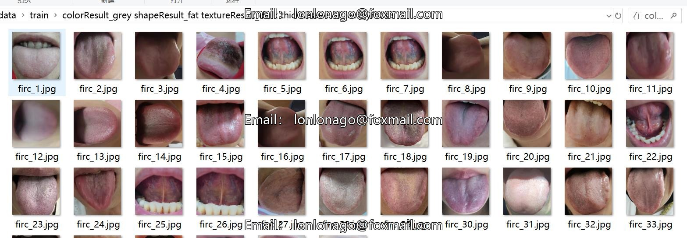
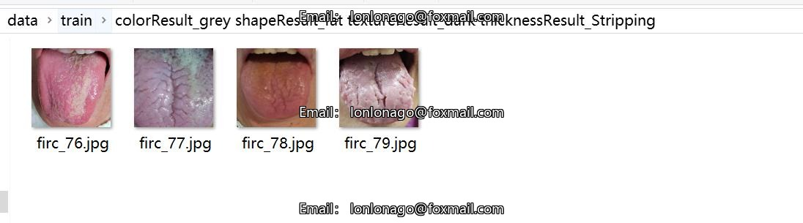

# Tonsils and Tongue Image Classification Dataset with 9890 Images and 166 Categories

Dataset type: Image classification
Dataset format: Only includes jpg images, each class folder contains the corresponding image.
number of images: 9890  
number of classes: 166  
image resolution: 640x640  
category names:['colorResult_grey shapeResult_ToothMarks textureResult_dark thicknessResult_Stripping','colorResult_grey shapeResult_ToothMarks textureResult_dark thicknessResult_ecchymosis','colorResult_grey shapeResult_ToothMarks textureResult_dark thicknessResult_greasy','colorResult_grey shapeResult_ToothMarks textureResult_dark thicknessResult_thin','colorResult_grey shapeResult_ToothMarks textureResult_normal thicknessResult_Stripping','colorResult_grey shapeResult_ToothMarks textureResult_normal thicknessResult_ecchymosis','colorResult_grey shapeResult_ToothMarks textureResult_normal thicknessResult_greasy','colorResult_grey shapeResult_ToothMarks textureResult_normal thicknessResult_thin','colorResult_grey shapeResult_ToothMarks textureResult_tender thicknessResult_Stripping','colorResult_grey shapeResult_ToothMarks textureResult_tender thicknessResult_greasy','colorResult_grey shapeResult_ToothMarks textureResult_water thicknessResult_Stripping','colorResult_grey shapeResult_ToothMarks textureResult_water thicknessResult_ecchymosis','colorResult_grey shapeResult_ToothMarks textureResult_water thicknessResult_greasy','colorResult_grey shapeResult_ToothMarks textureResult_water thicknessResult_thin','colorResult_grey shapeResult_fat textureResult_dark thicknessResult_Stripping','colorResult_grey shapeResult_fat textureResult_dark thicknessResult_ecchymosis','colorResult_grey shapeResult_fat textureResult_dark thicknessResult_greasy','colorResult_grey shapeResult_fat textureResult_dark thicknessResult_thin','colorResult_grey shapeResult_fat textureResult_normal thicknessResult_ecchymosis','colorResult_grey shapeResult_fat textureResult_normal thicknessResult_greasy','colorResult_grey shapeResult_fat textureResult_normal thicknessResult_thin','colorResult_grey shapeResult_fat textureResult_tender thicknessResult_Stripping','colorResult_grey shapeResult_fat textureResult_tender thicknessResult_ecchymosis','colorResult_grey shapeResult_fat textureResult_tender thicknessResult_greasy','colorResult_grey shapeResult_fat textureResult_water thicknessResult_Stripping','colorResult_grey shapeResult_fat textureResult_water thicknessResult_ecchymosis','colorResult_grey shapeResult_fat textureResult_water thicknessResult_greasy','colorResult_grey shapeResult_fat textureResult_water thicknessResult_thin','colorResult_grey shapeResult_normal textureResult_dark thicknessResult_Stripping','colorResult_grey shapeResult_normal textureResult_dark thicknessResult_ecchymosis','colorResult_grey shapeResult_normal textureResult_dark thicknessResult_greasy','colorResult_grey shapeResult_normal textureResult_dark thicknessResult_thin','colorResult_grey shapeResult_normal textureResult_normal thicknessResult_Stripping','colorResult_grey shapeResult_normal textureResult_normal thicknessResult_greasy','colorResult_grey shapeResult_normal textureResult_normal thicknessResult_thin','colorResult_grey shapeResult_normal textureResult_tender thicknessResult_thin','colorResult_grey shapeResult_normal textureResult_water thicknessResult_greasy','colorResult_grey shapeResult_normal textureResult_water thicknessResult_thin','colorResult_grey shapeResult_thin textureResult_dark thicknessResult_Stripping','colorResult_grey shapeResult_thin textureResult_dark thicknessResult_ecchymosis','colorResult_grey shapeResult_thin textureResult_dark thicknessResult_greasy','colorResult_grey shapeResult_thin textureResult_dark thicknessResult_thin','colorResult_grey shapeResult_thin textureResult_normal thicknessResult_ecchymosis','colorResult_grey shapeResult_thin textureResult_normal thicknessResult_greasy','colorResult_grey shapeResult_thin textureResult_normal thicknessResult_thin','colorResult_grey shapeResult_thin textureResult_tender thicknessResult_greasy','colorResult_grey shapeResult_thin textureResult_tender thicknessResult_thin','colorResult_grey shapeResult_thin textureResult_water thicknessResult_Stripping','colorResult_grey shapeResult_thin textureResult_water thicknessResult_greasy','colorResult_grey shapeResult_thin textureResult_water thicknessResult_thin','colorResult_white shapeResult_ToothMarks textureResult_dark thicknessResult_Stripping','colorResult_white shapeResult_ToothMarks textureResult_dark thicknessResult_ecchymosis','colorResult_white shapeResult_ToothMarks textureResult_dark thicknessResult_greasy','colorResult_white shapeResult_ToothMarks textureResult_dark thicknessResult_thin','colorResult_white shapeResult_ToothMarks textureResult_normal thicknessResult_Stripping','colorResult_white shapeResult_ToothMarks textureResult_normal thicknessResult_ecchymosis','colorResult_white shapeResult_ToothMarks textureResult_normal thicknessResult_greasy','colorResult_white shapeResult_ToothMarks textureResult_normal thicknessResult_thin','colorResult_white shapeResult_ToothMarks textureResult_tender thicknessResult_greasy','colorResult_white shapeResult_ToothMarks textureResult_tender thicknessResult_thin','colorResult_white shapeResult_ToothMarks textureResult_water thicknessResult_Stripping','colorResult_white shapeResult_ToothMarks textureResult_water thicknessResult_ecchymosis','colorResult_white shapeResult_ToothMarks textureResult_water thicknessResult_greasy','colorResult_white shapeResult_ToothMarks textureResult_water thicknessResult_thin','colorResult_white shapeResult_fat textureResult_dark thicknessResult_Stripping','colorResult_white shapeResult_fat textureResult_dark thicknessResult_ecchymosis','colorResult_white shapeResult_fat textureResult_dark thicknessResult_greasy','colorResult_white shapeResult_fat textureResult_dark thicknessResult_thin','colorResult_white shapeResult_fat textureResult_normal thicknessResult_Stripping','colorResult_white shapeResult_fat textureResult_normal thicknessResult_ecchymosis','colorResult_white shapeResult_fat textureResult_normal thicknessResult_greasy','colorResult_white shapeResult_fat textureResult_normal thicknessResult_thin','colorResult_white shapeResult_fat textureResult_tender thicknessResult_Stripping','colorResult_white shapeResult_fat textureResult_tender thicknessResult_ecchymosis','colorResult_white shapeResult_fat textureResult_tender thicknessResult_greasy','colorResult_white shapeResult_fat textureResult_tender thicknessResult_thin','colorResult_white shapeResult_fat textureResult_water thicknessResult_Stripping','colorResult_white shapeResult_fat textureResult_water thicknessResult_ecchymosis','colorResult_white shapeResult_fat textureResult_water thicknessResult_greasy','colorResult_white shapeResult_fat textureResult_water thicknessResult_thin','colorResult_white shapeResult_normal textureResult_dark thicknessResult_Stripping','colorResult_white shapeResult_normal textureResult_dark thicknessResult_ecchymosis','colorResult_white shapeResult_normal textureResult_dark thicknessResult_greasy','colorResult_white shapeResult_normal textureResult_dark thicknessResult_thin','colorResult_white shapeResult_normal textureResult_normal thicknessResult_Stripping','colorResult_white shapeResult_normal textureResult_normal thicknessResult_ecchymosis','colorResult_white shapeResult_normal textureResult_normal thicknessResult_greasy','colorResult_white shapeResult_normal textureResult_normal thicknessResult_thin','colorResult_white shapeResult_normal textureResult_tender thicknessResult_Stripping','colorResult_white shapeResult_normal textureResult_tender thicknessResult_ecchymosis','colorResult_white shapeResult_normal textureResult_tender thicknessResult_greasy','colorResult_white shapeResult_normal textureResult_tender thicknessResult_thin','colorResult_white shapeResult_normal textureResult_water thicknessResult_Stripping','colorResult_white shapeResult_normal textureResult_water thicknessResult_greasy','colorResult_white shapeResult_normal textureResult_water thicknessResult_thin','colorResult_white shapeResult_thin textureResult_dark thicknessResult_Stripping','colorResult_white shapeResult_thin textureResult_dark thicknessResult_ecchymosis','colorResult_white shapeResult_thin textureResult_dark thicknessResult_greasy','colorResult_white shapeResult_thin textureResult_dark thicknessResult_thin','colorResult_white shapeResult_thin textureResult_normal thicknessResult_Stripping','colorResult_white shapeResult_thin textureResult_normal thicknessResult_ecchymosis','colorResult_white shapeResult_thin textureResult_normal thicknessResult_greasy','colorResult_white shapeResult_thin textureResult_normal thicknessResult_thin','colorResult_white shapeResult_thin textureResult_tender thicknessResult_Stripping','colorResult_white shapeResult_thin textureResult_tender thicknessResult_greasy','colorResult_white shapeResult_thin textureResult_tender thicknessResult_thin','colorResult_white shapeResult_thin textureResult_water thicknessResult_Stripping','colorResult_white shapeResult_thin textureResult_water thicknessResult_greasy','colorResult_white shapeResult_thin textureResult_water thicknessResult_thin','colorResult_yellow shapeResult_ToothMarks textureResult_dark thicknessResult_Stripping','colorResult_yellow shapeResult_ToothMarks textureResult_dark thicknessResult_ecchymosis','colorResult_yellow shapeResult_ToothMarks textureResult_dark thicknessResult_greasy','colorResult_yellow shapeResult_ToothMarks textureResult_dark thicknessResult_thin','colorResult_yellow shapeResult_ToothMarks textureResult_normal thicknessResult_Stripping','colorResult_yellow shapeResult_ToothMarks textureResult_normal thicknessResult_greasy','colorResult_yellow shapeResult_ToothMarks textureResult_normal thicknessResult_thin','colorResult_yellow shapeResult_ToothMarks textureResult_tender thicknessResult_Stripping','colorResult_yellow shapeResult_ToothMarks textureResult_tender thicknessResult_greasy','colorResult_yellow shapeResult_ToothMarks textureResult_tender thicknessResult_thin','colorResult_yellow shapeResult_ToothMarks textureResult_water thicknessResult_Stripping','colorResult_yellow shapeResult_ToothMarks textureResult_water thicknessResult_ecchymosis','colorResult_yellow shapeResult_ToothMarks textureResult_water thicknessResult_greasy','colorResult_yellow shapeResult_ToothMarks textureResult_water thicknessResult_thin','colorResult_yellow shapeResult_fat textureResult_dark thicknessResult_Stripping','colorResult_yellow shapeResult_fat textureResult_dark thicknessResult_ecchymosis','colorResult_yellow shapeResult_fat textureResult_dark thicknessResult_greasy','colorResult_yellow shapeResult_fat textureResult_dark thicknessResult_thin','colorResult_yellow shapeResult_fat textureResult_normal thicknessResult_Stripping','colorResult_yellow shapeResult_fat textureResult_normal thicknessResult_ecchymosis','colorResult_yellow shapeResult_fat textureResult_normal thicknessResult_greasy','colorResult_yellow shapeResult_fat textureResult_normal thicknessResult_thin','colorResult_yellow shapeResult_fat textureResult_tender thicknessResult_Stripping','colorResult_yellow shapeResult_fat textureResult_tender thicknessResult_ecchymosis','colorResult_yellow shapeResult_fat textureResult_tender thicknessResult_greasy','colorResult_yellow shapeResult_fat textureResult_tender thicknessResult_thin','colorResult_yellow shapeResult_fat textureResult_water thicknessResult_Stripping','colorResult_yellow shapeResult_fat textureResult_water thicknessResult_greasy','colorResult_yellow shapeResult_fat textureResult_water thicknessResult_thin','colorResult_yellow shapeResult_normal textureResult_dark thicknessResult_Stripping','colorResult_yellow shapeResult_normal textureResult_dark thicknessResult_ecchymosis','colorResult_yellow shapeResult_normal textureResult_dark thicknessResult_greasy','colorResult_yellow shapeResult_normal textureResult_dark thicknessResult_thin','colorResult_yellow shapeResult_normal textureResult_normal thicknessResult_Stripping','colorResult_yellow shapeResult_normal textureResult_normal thicknessResult_ecchymosis','colorResult_yellow shapeResult_normal textureResult_normal thicknessResult_greasy','colorResult_yellow shapeResult_normal textureResult_normal thicknessResult_thin','colorResult_yellow shapeResult_normal textureResult_tender thicknessResult_Stripping','colorResult_yellow shapeResult_normal textureResult_tender thicknessResult_greasy','colorResult_yellow shapeResult_normal textureResult_tender thicknessResult_thin','colorResult_yellow shapeResult_normal textureResult_water thicknessResult_Stripping','colorResult_yellow shapeResult_normal textureResult_water thicknessResult_ecchymosis','colorResult_yellow shapeResult_normal textureResult_water thicknessResult_greasy','colorResult_yellow shapeResult_normal textureResult_water thicknessResult_thin','colorResult_yellow shapeResult_thin textureResult_dark thicknessResult_Stripping','colorResult_yellow shapeResult_thin textureResult_dark thicknessResult_ecchymosis','colorResult_yellow shapeResult_thin textureResult_dark thicknessResult_greasy','colorResult_yellow shapeResult_thin textureResult_dark thicknessResult_thin','colorResult_yellow shapeResult_thin textureResult_normal thicknessResult_Stripping','colorResult_yellow shapeResult_thin textureResult_normal thicknessResult_greasy','colorResult_yellow shapeResult_thin textureResult_normal thicknessResult_thin','colorResult_yellow shapeResult_thin textureResult_tender thicknessResult_Stripping','colorResult_yellow shapeResult_thin textureResult_tender thicknessResult_ecchymosis','colorResult_yellow shapeResult_thin textureResult_tender thicknessResult_greasy','colorResult_yellow shapeResult_thin textureResult_tender thicknessResult_thin','colorResult_yellow shapeResult_thin textureResult_water thicknessResult_greasy','colorResult_yellow shapeResult_thin textureResult_water thicknessResult_thin']  
images per class:   
training set image count: 7929  
- colorResult_grey shapeResult_fat textureResult_dark thicknessResult_ecchymosistraining set image count: 39  
- colorResult_grey shapeResult_fat textureResult_dark thicknessResult_greasytraining set image count: 36  
- colorResult_grey shapeResult_fat textureResult_dark thicknessResult_Strippingtraining set image count: 4  
- colorResult_grey shapeResult_fat textureResult_dark thicknessResult_thintraining set image count: 22  
- colorResult_grey shapeResult_fat textureResult_normal thicknessResult_ecchymosistraining set image count: 2  
- colorResult_grey shapeResult_fat textureResult_normal thicknessResult_greasytraining set image count: 7  
- colorResult_grey shapeResult_fat textureResult_normal thicknessResult_thintraining set image count: 7  
The training set images for each color, shape, texture, and thickness result are as follows:
- For colorResult_grey, shapeResult_fat, textureResult_tender, thicknessResult_ecchymosis: 2 images
- For colorResult_grey, shapeResult_fat, textureResult_tender, thicknessResult_greasy: 4 images
- For colorResult_grey, shapeResult_fat, textureResult_water, thicknessResult_ecchymosis: 1 image
- For colorResult_grey, shapeResult_fat, textureResult_water, thicknessResult_greasy: 3 images
- For colorResult_grey, shapeResult_fat, textureResult_water, thicknessResult_Stripping: 4 images
- For colorResult_grey, shapeResult_fat, textureResult_water, thicknessResult_thin: 4 images
- For colorResult_grey, shapeResult_normal, textureResult_dark, thicknessResult_ecchymosis: 33 images
- For colorResult_grey, shapeResult_normal, textureResult_dark, thicknessResult_greasy: 34 images
- For colorResult_grey, shapeResult_normal, textureResult_dark, thicknessResult_Stripping: 6 images
- For colorResult_grey, shapeResult_normal, textureResult_dark, thicknessResult_thin: 19 images
- For colorResult_grey, shapeResult_normal, textureResult_normal, thicknessResult_greasy: 4 images
- For colorResult_grey, shapeResult_normal, textureResult_normal, thicknessResult_Stripping: 1 image
- For colorResult_grey, shapeResult_normal, textureResult_normal, thicknessResult_thin: 5 images
- For colorResult_grey, shapeResult_normal, textureResult_tender, thicknessResult_thin: 1 image
- colorResult_grey shapeResult_normal textureResult_water thicknessResult_greasy training set image count: 2  
- colorResult_grey shapeResult_normal textureResult_water thicknessResult_thin training set image count: 5  
- colorResult_grey shapeResult_thin textureResult_dark thicknessResult_ecchymosis training set image count: 8  
- colorResult_grey shapeResult_thin textureResult_dark thicknessResult_greasy training set image count: 6  
- colorResult_grey shapeResult_thin textureResult_dark thicknessResult_Stripping training set image count: 3  
- colorResult_grey shapeResult_thin textureResult_dark thicknessResult_thin training set image count: 10  
- colorResult_grey shapeResult_thin textureResult_normal thicknessResult_ecchymosis training set image count: 1  
- colorResult_grey shapeResult_thin textureResult_normal thicknessResult_greasy training set image count: 5  
- colorResult_grey shapeResult_thin textureResult_normal thicknessResult_thin training set image count: 4  
- colorResult_grey shapeResult_thin textureResult_tender thicknessResult_greasy training set image count: 1  
- colorResult_grey shapeResult_thin textureResult_tender thicknessResult_thin training set image count: 1  
- colorResult_grey shapeResult_thin textureResult_water thicknessResult_greasy training set image count: 2  
- colorResult_grey shapeResult_thin textureResult_water thicknessResult_Stripping training set image count: 1  
- colorResult_grey shapeResult_thin textureResult_water thicknessResult_thin training set image count: 5  
- colorResult_grey shapeResult_ToothMarks textureResult_dark thicknessResult_ecchymosis training set image count: 43
- Number of training set images for colorResult_grey, shapeResult_ToothMarks, textureResult_dark, thicknessResult_greasy: 34
- Number of training set images for colorResult_grey, shapeResult_ToothMarks, textureResult_normal, thicknessResult_ecchymosis: 4
- Number of training set images for colorResult_grey, shapeResult_ToothMarks, textureResult_normal, thicknessResult_greasy: 15
- Number of training set images for colorResult_grey, shapeResult_ToothMarks, textureResult_tender, thicknessResult_ecchymosis: 1
- Number of training set images for colorResult_grey, shapeResult_ToothMarks, textureResult_tender, thicknessResult_greasy: 6
- Number of training set images for colorResult_grey, shapeResult_ToothMarks, textureResult_normal, thicknessResult_stripping: 1
- Number of training set images for colorResult_grey, shapeResult_ToothMarks, textureResult_normal, thicknessResult_thin: 5
- Number of training set images for colorResult_grey, shapeResult_ToothMarks, textureResult_tender, thicknessResult_ecchymosis: 1
- Number of training set images for colorResult_grey, shapeResult_ToothMarks, textureResult_tender, thicknessResult_stripping: 2
- Number of training set images for colorResult_grey, shapeResult_ToothMarks, textureResult_water, thicknessResult_ecchymosis: 1
- Number of training set images for colorResult_grey, shapeResult_ToothMarks, textureResult_water, thicknessResult_greasy: 1
- Number of training set images for colorResult_grey, shapeResult_ToothMarks, textureResult_water, thicknessResult_Stripping: 2
- Number of training set images for colorResult_grey, shapeResult_ToothMarks, textureResult_water, thicknessResult_thin: 5
- Number of training set images for colorResult_white, shapeResult_fat, textureResult_dark, thicknessResult_ecchymosis: 18
- Number of training set images for colorResult_white, shapeResult_fat, textureResult_dark, thicknessResult_greasy: 113
- colorResult_white shapeResult_fat textureResult_dark thicknessResult_Strippingtraining set image count: 24  
- colorResult_white shapeResult_fat textureResult_dark thicknessResult_thin training set image count: 88
- colorResult_white shapeResult_fat textureResult_normal thicknessResult_ecchymosistraining set image count: 7  
- colorResult_white shapeResult_fat textureResult_normal thicknessResult_greasytraining set image count: 211  
- colorResult_white shapeResult_fat textureResult_normal thicknessResult_Strippingtraining set image count: 14  
- colorResult_white shapeResult_fat textureResult_normal thicknessResult_thintraining set image count: 263  
- colorResult_white shapeResult_fat textureResult_tender thicknessResult_ecchymosis number of training set images: 3
- colorResult_white shapeResult_fat textureResult_tender thicknessResult_greasy training set image count: 120
- colorResult_white shapeResult_fat textureResult_tender thicknessResult_Stripping training set image count: 19
- colorResult_white shapeResult_fat textureResult_tender thicknessResult_thin training set image number: 140
- colorResult_white shapeResult_fat textureResult_water thicknessResult_ecchymosis training set image count: 1
- colorResult_white shapeResult_fat textureResult_water thicknessResult_greasy training set image number: 200
- colorResult_white shapeResult_fat textureResult_water thicknessResult_Strippingtraining set image count: 52  
- colorResult_white shapeResult_fat textureResult_water thicknessResult_thintraining set image count: 132  
- colorResult_white shapeResult_normal textureResult_dark thicknessResult_ecchymosistraining set image count: 34  
- colorResult_white shapeResult_normal textureResult_dark thicknessResult_greasy training set image count: 193
- colorResult_white shapeResult_normal textureResult_dark thicknessResult_Stripping training set image count: 28
- colorResult_white shapeResult_normal textureResult_dark thicknessResult_thin training set image count: 171
- colorResult_white shapeResult_normal textureResult_normal thicknessResult_ecchymosis training set image count: 14
- colorResult_white shapeResult_normal textureResult_normal thicknessResult_greasy training set image count: 444
- colorResult_white shapeResult_normal textureResult_normal thicknessResult_Stripping training set image count: 40
- colorResult_white shapeResult_normal textureResult_normal thicknessResult_thin training set image count: 1047
- colorResult_white shapeResult_normal textureResult_tender thicknessResult_ecchymosis training set image count: 2
- colorResult_white shapeResult_normal textureResult_tender thicknessResult_greasy training set image count: 90
- colorResult_white shapeResult_normal textureResult_tender thicknessResult_Stripping training set image count: 17
- colorResult_white shapeResult_normal textureResult_tender thicknessResult_thin training set image count: 155
- colorResult_white shapeResult_normal textureResult_water thicknessResult_greasy training set image count: 87
- colorResult_white shapeResult_normal textureResult_water thicknessResult_Stripping training set image count: 54
- colorResult_white shapeResult_normal textureResult_water thicknessResult_thin training set image count: 103
- colorResult_white shapeResult_thin textureResult_dark thicknessResult_ecchymosis training set image count: 10
- colorResult_white shapeResult_thin textureResult_dark thicknessResult_greasy training set image number: 33
- colorResult_white shapeResult_thin textureResult_dark thicknessResult_Strippingtraining set image count: 5  
- colorResult_white shapeResult_thin textureResult_dark thicknessResult_thintraining set image count: 33  
The training set contains 1 image.
- colorResult_white shapeResult_thin textureResult_normal thicknessResult_greasy training set images: 38
- colorResult_white shapeResult_thin textureResult_normal thicknessResult_Strippingtraining set image count: 7  
- colorResult_white shapeResult_thin textureResult_normal thicknessResult_thintraining set image count: 66  
- colorResult_white shapeResult_thin textureResult_tender thicknessResult_greasytraining set image count: 16  
- colorResult_white shapeResult_thin textureResult_tender thicknessResult_Stripping training set images: 7
- training set image count: 15
- colorResult_white shapeResult_thin textureResult_water thicknessResult_greasy training set image count: 28
The training set contains 4 images, with color result_white, shape result_thin, texture result_water and thickness result_Stripping.
- colorResult_white shapeResult_thin textureResult_water thicknessResult_thintraining set image count: 21  
- colorResult_white shapeResult_ToothMarks textureResult_dark thicknessResult_ecchymosistraining set image count: 18  
- colorResult_white shapeResult_ToothMarks textureResult_dark thicknessResult_greasytraining set image count: 96  
- colorResult_white shapeResult_ToothMarks textureResult_dark thicknessResult_Stripping training set image count: 11
- colorResult_white shapeResult_ToothMarks textureResult_dark thicknessResult_thin training set image count: 107
- colorResult_white shapeResult_ToothMarks textureResult_normal thicknessResult_ecchymosistraining set image count: 9  
- colorResult_white shapeResult_ToothMarks textureResult_normal thicknessResult_greasytraining set image count: 153  
- colorResult_white shapeResult_ToothMarks textureResult_normal thicknessResult_Strippingtraining set image count: 8  
- colorResult_white shapeResult_ToothMarks textureResult_normal thicknessResult_thintraining set image count: 267  
- colorResult_white shapeResult_ToothMarks textureResult_tender thicknessResult_greasytraining set image count: 79  
- colorResult_white shapeResult_ToothMarks textureResult_tender thicknessResult_thin training set image count: 107
- colorResult_white shapeResult_ToothMarks textureResult_water thicknessResult_ecchymosistraining set image count: 2  
- colorResult_white shapeResult_ToothMarks textureResult_water thicknessResult_greasy training set image number: 115
- colorResult_white shapeResult_ToothMarks textureResult_water thicknessResult_Stripping training set image count: 52
- colorResult_white shapeResult_ToothMarks textureResult_water thicknessResult_thin training set image count: 79
- colorResult_yellow shapeResult_fat textureResult_dark thicknessResult_ecchymosistraining set image count: 11  
- colorResult_yellow shapeResult_fat textureResult_dark thicknessResult_greasytraining set image count: 164  
- colorResult_yellow shapeResult_fat textureResult_dark thicknessResult_Strippingtraining set image count: 15  
- Color Result_yellow: 31 images
- Color Result_yellow: 3 images
- Color Result_yellow: 136 images
- Color Result_yellow: 8 images
- Color Result_yellow: 42 images
- Color Result_yellow: 2 images
- Color Result_yellow: 78 images
- Color Result_yellow: 4 images
- Color Result_yellow: 32 images
- Color Result_yellow: 98 images
- Color Result_yellow: 19 images
- Color Result_yellow: 23 images
- Texture Result_normal: 12 images
- Texture Result_normal: 178 images
- Texture Result_normal: 18 images
- colorResult_yellow shapeResult_normal textureResult_dark thicknessResult_ecchymosis training set image count: 54
- colorResult_yellow shapeResult_normal textureResult_normal thicknessResult_ecchymosis training set image count: 2
- colorResult_yellow shapeResult_normal textureResult_normal thicknessResult_greasy training set image count: 355
- colorResult_yellow shapeResult_normal textureResult_normal thicknessResult_Stripping training set image count: 24
- colorResult_yellow shapeResult_normal textureResult_normal thicknessResult_thin training set image count: 169
- colorResult_yellow shapeResult_normal textureResult_tender thicknessResult_greasy training set image count: 74
- colorResult_yellow shapeResult_normal textureResult_tender thicknessResult_Stripping training set image count: 7
- colorResult_yellow shapeResult_normal textureResult_tender thicknessResult_thin training set image count: 17
- colorResult_yellow shapeResult_normal textureResult_water thicknessResult_ecchymosis training set image count: 2
- colorResult_yellow shapeResult_normal textureResult_water thicknessResult_greasy training set image count: 66
- colorResult_yellow shapeResult_normal textureResult_water thicknessResult_Stripping training set image count: 3
- colorResult_yellow shapeResult_normal textureResult_water thicknessResult_thin training set image count: 15
- colorResult_yellow shapeResult_thin textureResult_dark thicknessResult_ecchymosis training set image count: 6
- colorResult_yellow shapeResult_thin textureResult_dark thicknessResult_greasy training set image count: 60
- colorResult_yellow shapeResult_thin textureResult_dark thicknessResult_Stripping training set image count: 5
- colorResult_yellow shapeResult_thin textureResult_dark thicknessResult_thintraining set image count: 13  
- colorResult_yellow shapeResult_thin textureResult_normal thicknessResult_greasytraining set image count: 44  
- colorResult_yellow shapeResult_thin textureResult_normal thicknessResult_Strippingtraining set image count: 3  
- colorResult_yellow shapeResult_thin textureResult_normal thicknessResult_thintraining set image count: 23  
- colorResult_yellow shapeResult_thin textureResult_tender thicknessResult_ecchymosistraining set image count: 1  
- colorResult_yellow shapeResult_thin textureResult_tender thicknessResult_greasytraining set image count: 9  
- colorResult_yellow shapeResult_thin textureResult_tender thicknessResult_Strippingtraining set image count: 5  
- colorResult_yellow shapeResult_thin textureResult_tender thicknessResult_thintraining set image count: 1  
- colorResult_yellow shapeResult_thin textureResult_water thicknessResult_greasytraining set image count: 21  
- colorResult_yellow shapeResult_thin textureResult_water thicknessResult_thintraining set image count: 7  
- colorResult_yellow shapeResult_ToothMarks textureResult_dark thicknessResult_ecchymosistraining set image count: 9  
- colorResult_yellow shapeResult_ToothMarks textureResult_dark thicknessResult_greasytraining set image count: 112  
- colorResult_yellow shapeResult_ToothMarks textureResult_dark thicknessResult_Strippingtraining set image count: 6  
- colorResult_yellow shapeResult_ToothMarks textureResult_dark thicknessResult_thintraining set image count: 21  
- colorResult_yellow shapeResult_ToothMarks textureResult_normal thicknessResult_greasytraining set image count: 88  
- colorResult_yellow shapeResult_ToothMarks textureResult_normal thicknessResult_stripping training set image count: 3  
- colorResult_yellow shapeResult_ToothMarks textureResult_normal thicknessResult_thin training set image count: 37  
- colorResult_yellow shapeResult_ToothMarks textureResult_tender thicknessResult_greasy training set image count: 21  
- colorResult_yellow shapeResult_ToothMarks textureResult_tender thicknessResult_stripping training set image count: 2  
- colorResult_yellow shapeResult_ToothMarks textureResult_tender thicknessResult_thin training set image count: 11  
- colorResult_yellow shapeResult_ToothMarks textureResult_water thicknessResult_ecchymosis training set image count: 3  
- colorResult_yellow shapeResult_ToothMarks textureResult_water thicknessResult_greasy training set image count: 50  
- colorResult_yellow shapeResult_ToothMarks textureResult_water thicknessResult_stripping training set image count: 9  
- colorResult_yellow shapeResult_ToothMarks textureResult_water thicknessResult_thin training set image count: 11  
- validation set image count: 973  
- colorResult_grey shapeResult_fat textureResult_dark thicknessResult_ecchymosis validation set image count: 5  
- colorResult_grey shapeResult_fat textureResult_dark thicknessResult_greasy validation set image count: 4  
- colorResult_grey shapeResult_fat textureResult_dark thicknessResult_thin validation set image count: 2  
- colorResult_grey shapeResult_fat textureResult_normal thicknessResult_greasy validation set image count: 3  
- colorResult_grey shapeResult_fat textureResult_normal thicknessResult_thin validation set image count: 2
- colorResult_grey shapeResult_fat textureResult_water thicknessResult_thinvalidation set image count: 2  
- colorResult_grey shapeResult_normal textureResult_dark thicknessResult_ecchymosisvalidation set image count: 5  
- colorResult_grey shapeResult_normal textureResult_dark thicknessResult_greasyvalidation set image count: 4  
- colorResult_grey shapeResult_normal textureResult_dark thicknessResult_Strippingvalidation set image count: 1  
- colorResult_grey shapeResult_normal textureResult_dark thicknessResult_thinvalidation set image count: 1  
- colorResult_grey shapeResult_normal textureResult_normal thicknessResult_greasyvalidation set image count: 1  
- colorResult_grey shapeResult_normal textureResult_normal thicknessResult_thinvalidation set image count: 1  
- colorResult_grey shapeResult_normal textureResult_tender thicknessResult_greasyvalidation set image count: 1  
- colorResult_grey shapeResult_normal textureResult_water thicknessResult_thinvalidation set image count: 1  
- colorResult_grey shapeResult_thin textureResult_dark thicknessResult_greasyvalidation set image count: 1  
- colorResult_grey shapeResult_thin textureResult_dark thicknessResult_thinvalidation set image count: 1  
- colorResult_grey shapeResult_ToothMarks textureResult_dark thicknessResult_ecchymosisvalidation set image count: 3  
- colorResult_grey shapeResult_ToothMarks textureResult_dark thicknessResult_greasyvalidation set image count: 3  
- colorResult_grey shapeResult_ToothMarks textureResult_dark thicknessResult_Strippingvalidation set image count: 1  
- colorResult_grey shapeResult_ToothMarks textureResult_dark thicknessResult_thinvalidation set image count: 2  
- colorResult_grey shapeResult_ToothMarks textureResult_tender thicknessResult_greasyvalidation set image count: 1  
- colorResult_grey shapeResult_ToothMarks textureResult_water thicknessResult_Strippingvalidation set image count: 1  
- colorResult_grey shapeResult_ToothMarks textureResult_water thicknessResult_thinvalidation set image count: 1  
- colorResult_white shapeResult_fat textureResult_dark thicknessResult_ecchymosisvalidation set image count: 2  
- colorResult_white shapeResult_fat textureResult_dark thicknessResult_greasyvalidation set image count: 15  
- colorResult_white shapeResult_fat textureResult_dark thicknessResult_Strippingvalidation set image count: 3  
- colorResult_white shapeResult_fat textureResult_dark thicknessResult_thinvalidation set image count: 11  
- colorResult_white shapeResult_fat textureResult_normal thicknessResult_ecchymosisvalidation set image count: 1  
- colorResult_white shapeResult_fat textureResult_normal thicknessResult_greasyvalidation set image count: 21  
- colorResult_white shapeResult_fat textureResult_normal thicknessResult_thinvalidation set image count: 36  
- colorResult_white shapeResult_fat textureResult_tender thicknessResult_ecchymosisvalidation set image count: 1  
- colorResult_white shapeResult_fat textureResult_tender thicknessResult_greasyvalidation set image count: 13  
- colorResult_white shapeResult_fat textureResult_tender thicknessResult_Strippingvalidation set image count: 1  
- colorResult_white shapeResult_fat textureResult_tender thicknessResult_thinvalidation set image count: 12  
- colorResult_white shapeResult_fat textureResult_water thicknessResult_greasyvalidation set image count: 20  
- colorResult_white shapeResult_fat textureResult_water thicknessResult_Strippingvalidation set image count: 10  
- colorResult_white shapeResult_fat textureResult_water thicknessResult_thinvalidation set image count: 16  
- colorResult_white shapeResult_normal textureResult_dark thicknessResult_ecchymosisvalidation set image count: 1  
- colorResult_white shapeResult_normal textureResult_dark thicknessResult_greasyvalidation set image count: 28  
- colorResult_white shapeResult_normal textureResult_dark thicknessResult_Strippingvalidation set image count: 3  
- colorResult_white shapeResult_normal textureResult_dark thicknessResult_thinvalidation set image count: 21  
- colorResult_white shapeResult_normal textureResult_normal thicknessResult_ecchymosisvalidation set image count: 3  
- colorResult_white shapeResult_normal textureResult_normal thicknessResult_greasyvalidation set image count: 67  
- colorResult_white shapeResult_normal textureResult_normal thicknessResult_Strippingvalidation set image count: 6  
- colorResult_white shapeResult_normal textureResult_normal thicknessResult_thinvalidation set image count: 107  
- colorResult_white shapeResult_normal textureResult_tender thicknessResult_ecchymosisvalidation set image count: 1  
- colorResult_white shapeResult_normal textureResult_tender thicknessResult_greasyvalidation set image count: 13  
- colorResult_white shapeResult_normal textureResult_tender thicknessResult_Strippingvalidation set image count: 5  
- colorResult_white shapeResult_normal textureResult_tender thicknessResult_thinvalidation set image count: 16  
- colorResult_white shapeResult_normal textureResult_water thicknessResult_greasyvalidation set image count: 9  
- colorResult_white shapeResult_normal textureResult_water thicknessResult_Strippingvalidation set image count: 4
- colorResult_white shapeResult_normal textureResult_water thicknessResult_thinvalidation set image count: 14
- colorResult_white shapeResult_thin textureResult_dark thicknessResult_greasyvalidation set image count: 4
- colorResult_white shapeResult_thin textureResult_dark thicknessResult_Strippingvalidation set image count: 1
- colorResult_white shapeResult_thin textureResult_dark thicknessResult_thinvalidation set image count: 5
- colorResult_white shapeResult_thin textureResult_normal thicknessResult_ecchymosisvalidation set image count: 1
- colorResult_white shapeResult_thin textureResult_normal thicknessResult_greasyvalidation set image count: 1
- colorResult_white shapeResult_thin textureResult_normal thicknessResult_Strippingvalidation set image count: 1
- colorResult_white shapeResult_thin textureResult_normal thicknessResult_thinvalidation set image count: 8
- colorResult_white shapeResult_thin textureResult_tender thicknessResult_greasyvalidation set image count: 2
- colorResult_white shapeResult_thin textureResult_tender thicknessResult_thinvalidation set image count: 2
- colorResult_white shapeResult_thin textureResult_water thicknessResult_greasyvalidation set image count: 6
- colorResult_white shapeResult_thin textureResult_water thicknessResult_thinvalidation set image count: 5
- colorResult_white shapeResult_ToothMarks textureResult_dark thicknessResult_ecchymosisvalidation set image count: 3
- colorResult_white shapeResult_ToothMarks textureResult_dark thicknessResult_greasyvalidation set image count: 15
- colorResult_white shapeResult_ToothMarks textureResult_dark thicknessResult_thinvalidation set image count: 14  
- colorResult_white shapeResult_ToothMarks textureResult_normal thicknessResult_ecchymosisvalidation set image count: 1  
- colorResult_white shapeResult_ToothMarks textureResult_normal thicknessResult_greasyvalidation set image count: 23  
- colorResult_white shapeResult_ToothMarks textureResult_normal thicknessResult_Strippingvalidation set image count: 2  
- colorResult_white shapeResult_ToothMarks textureResult_normal thicknessResult_thinvalidation set image count: 34  
- colorResult_white shapeResult_ToothMarks textureResult_tender thicknessResult_greasyvalidation set image count: 14  
- colorResult_white shapeResult_ToothMarks textureResult_tender thicknessResult_Strippingvalidation set image count: 1  
- colorResult_white shapeResult_ToothMarks textureResult_tender thicknessResult_thinvalidation set image count: 8  
- colorResult_white shapeResult_ToothMarks textureResult_water thicknessResult_ecchymosisvalidation set image count: 1  
- colorResult_white shapeResult_ToothMarks textureResult_water thicknessResult_greasyvalidation set image count: 15  
- colorResult_white shapeResult_ToothMarks textureResult_water thicknessResult_Strippingvalidation set image count: 10  
- colorResult_white shapeResult_ToothMarks textureResult_water thicknessResult_thinvalidation set image count: 12  
- colorResult_yellow shapeResult_fat textureResult_dark thicknessResult_ecchymosisvalidation set image count: 3  
- colorResult_yellow shapeResult_fat textureResult_dark thicknessResult_greasyvalidation set image count: 15  
- colorResult_yellow shapeResult_fat textureResult_dark thicknessResult_Strippingvalidation set image count: 2  
- colorResult_yellow shapeResult_fat textureResult_dark thicknessResult_thin validation set image count: 4
- colorResult_yellow shapeResult_fat textureResult_normal thicknessResult_greasy validation set image count: 23
- colorResult_yellow shapeResult_fat textureResult_normal thicknessResult_Stripping validation set image count: 2
- colorResult_yellow shapeResult_fat textureResult_normal thicknessResult_thin validation set image count: 2
- colorResult_yellow shapeResult_fat textureResult_tender thicknessResult_greasy validation set image count: 8
- colorResult_yellow shapeResult_fat textureResult_tender thicknessResult_Stripping validation set image count: 1
- colorResult_yellow shapeResult_fat textureResult_tender thicknessResult_thin validation set image count: 1
- colorResult_yellow shapeResult_fat textureResult_water thicknessResult_greasy validation set image count: 12
- colorResult_yellow shapeResult_fat textureResult_water thicknessResult_Stripping validation set image count: 2
- colorResult_yellow shapeResult_fat textureResult_water thicknessResult_thin validation set image count: 4
- colorResult_yellow shapeResult_normal textureResult_dark thicknessResult_ecchymosis validation set image count: 2
- colorResult_yellow shapeResult_normal textureResult_dark thicknessResult_greasy validation set image count: 24
- colorResult_yellow shapeResult_normal textureResult_dark thicknessResult_Stripping validation set image count: 1
- colorResult_yellow shapeResult_normal textureResult_dark thicknessResult_thin validation set image count: 5
- colorResult_yellow shapeResult_normal textureResult_normal thicknessResult_greasy validation set image count: 45
- colorResult_yellow shapeResult_normal textureResult_normal thicknessResult_Stripping validation set image count: 2
- colorResult_yellow shapeResult_normal textureResult_normal thicknessResult_thin validation set image count: 24
- colorResult_yellow shapeResult_normal textureResult_tender thicknessResult_greasy validation set image count: 7
- colorResult_yellow shapeResult_normal textureResult_tender thicknessResult_thin validation set image count: 2
- colorResult_yellow shapeResult_normal textureResult_water thicknessResult_greasy validation set image count: 6
- colorResult_yellow shapeResult_normal textureResult_water thicknessResult_Stripping validation set image count: 1
- colorResult_yellow shapeResult_normal textureResult_water thicknessResult_thin validation set image count: 1
- colorResult_yellow shapeResult_thin textureResult_dark thicknessResult_ecchymosis validation set image count: 2
- colorResult_yellow shapeResult_thin textureResult_dark thicknessResult_greasy validation set image count: 3
- colorResult_yellow shapeResult_thin textureResult_dark thicknessResult_Stripping validation set image count: 2
- colorResult_yellow shapeResult_thin textureResult_dark thicknessResult_thin validation set image count: 3
- colorResult_yellow shapeResult_thin textureResult_normal thicknessResult_greasy validation set image count: 7
- colorResult_yellow shapeResult_thin textureResult_normal thicknessResult_thin validation set image count: 4
- colorResult_yellow shapeResult_thin textureResult_tender thicknessResult_greasy validation set image count: 2
- colorResult_yellow shapeResult_thin textureResult_water thicknessResult_thin validation set image count: 1
- colorResult_yellow shapeResult_ToothMarks textureResult_dark thicknessResult_ecchymosisvalidation set image count: 3  
- colorResult_yellow shapeResult_ToothMarks textureResult_dark thicknessResult_greasyvalidation set image count: 16  
- colorResult_yellow shapeResult_ToothMarks textureResult_dark thicknessResult_Strippingvalidation set image count: 1  
- colorResult_yellow shapeResult_ToothMarks textureResult_dark thicknessResult_thinvalidation set image count: 4  
- colorResult_yellow shapeResult_ToothMarks textureResult_normal thicknessResult_greasyvalidation set image count: 13  
- colorResult_yellow shapeResult_ToothMarks textureResult_normal thicknessResult_thinvalidation set image count: 4  
- colorResult_yellow shapeResult_ToothMarks textureResult_tender thicknessResult_ecchymosisvalidation set image count: 1  
- colorResult_yellow shapeResult_ToothMarks textureResult_tender thicknessResult_thinvalidation set image count: 2  
- colorResult_yellow shapeResult_ToothMarks textureResult_water thicknessResult_greasyvalidation set image count: 8  
- colorResult_yellow shapeResult_ToothMarks textureResult_water thicknessResult_thinvalidation set image count: 2  
test set image count: 988  
- colorResult_grey shapeResult_fat textureResult_dark thicknessResult_ecchymosistest set image count: 4  
- colorResult_grey shapeResult_fat textureResult_dark thicknessResult_greasytest set image count: 3  
- colorResult_grey shapeResult_fat textureResult_dark thicknessResult_thintest set image count: 2  
- colorResult_grey shapeResult_fat textureResult_normal thicknessResult_thintest set image count: 1  
Test Set Image Counts:
- Color Result_Grey, Shape Result_Fat, Texture Result_Tender, Thickness Result_Stripping: 1
- Color Result_Grey, Shape Result_Fat, Texture Result_Water, Thickness Result_Thin: 1
- Color Result_Grey, Shape Result_Fat, Texture Result_Water, Thickness Result_Thin: 1
- Color Result_Grey, Shape Result_Normal, Texture Result_Dark, Thickness Result_Echymosis: 5
- Color Result_Grey, Shape Result_Normal, Texture Result_Dark, Thickness Result_Greasy: 5
- Color Result_Grey, Shape Result_Normal, Texture Result_Dark, Thickness Result_Thin: 2
- Color Result_Grey, Shape Result_Normal, Texture Result_Normal, Thickness Result_Thin: 2
- Color Result_Grey, Shape Result_Normal, Texture Result_Water, Thickness Result_Thin: 1
- Color Result_Grey, Shape Result_Thin, Texture Result_Dark, Thickness Result_Echymosis: 2
- Color Result_Grey, Shape Result_Thin, Texture Result_Normal, Thickness Result_Thin: 1
- Color Result_Grey, Shape Result_Thin, Texture Result_Water, Thickness Result_Stripping: 1
- Color Result_Grey, Shape Result_ToothMarks, Texture Result_Dark, Thickness Result_Echymosis: 9
- Color Result_Grey, Shape Result_ToothMarks, Texture Result_Dark, Thickness Result_Greasy: 5
- Color Result_Grey, Shape Result_ToothMarks, Texture Result_Dark, Thickness Result_Stripping: 1
- colorResult_grey shapeResult_ToothMarks textureResult_dark thicknessResult_thin test set image count: 1  
- colorResult_grey shapeResult_ToothMarks textureResult_normal thicknessResult_greasy test set image count: 1  
- colorResult_grey shapeResult_ToothMarks textureResult_normal thicknessResult_thin test set image count: 2  
- colorResult_grey shapeResult_ToothMarks textureResult_tender thicknessResult_Stripping test set image count: 1  
- colorResult_grey shapeResult_ToothMarks textureResult_water thicknessResult_thin test set image count: 5  
- colorResult_white shapeResult_fat textureResult_dark thicknessResult_ecchymosis test set image count: 1  
- colorResult_white shapeResult_fat textureResult_dark thicknessResult_greasy test set image count: 13  
- colorResult_white shapeResult_fat textureResult_dark thicknessResult_Stripping test set image count: 3  
- colorResult_white shapeResult_fat textureResult_dark thicknessResult_thin test set image count: 11  
- colorResult_white shapeResult_fat textureResult_normal thicknessResult_greasy test set image count: 22  
- colorResult_white shapeResult_fat textureResult_normal thicknessResult_Stripping test set image count: 3  
- colorResult_white shapeResult_fat textureResult_normal thicknessResult_thin test set image count: 30  
- colorResult_white shapeResult_fat textureResult_tender thicknessResult_ecchymosis test set image count: 1  
- colorResult_white shapeResult_fat textureResult_tender thicknessResult_greasy test set image count: 13  
- colorResult_white shapeResult_fat textureResult_tender thicknessResult_thin test set image count: 20
- colorResult_white shapeResult_fat textureResult_water thicknessResult_ecchymosis test set image count: 1  
- colorResult_white shapeResult_fat textureResult_water thicknessResult_greasy test set image count: 25  
- colorResult_white shapeResult_fat textureResult_water thicknessResult_Stripping test set image count: 3  
- colorResult_white shapeResult_fat textureResult_water thicknessResult_thin test set image count: 16  
- colorResult_white shapeResult_normal textureResult_dark thicknessResult_ecchymosis test set image count: 6  
- colorResult_white shapeResult_normal textureResult_dark thicknessResult_greasy test set image count: 23  
- colorResult_white shapeResult_normal textureResult_dark thicknessResult_Stripping test set image count: 1  
- colorResult_white shapeResult_normal textureResult_dark thicknessResult_thin test set image count: 24  
- colorResult_white shapeResult_normal textureResult_normal thicknessResult_ecchymosis test set image count: 4  
- colorResult_white shapeResult_normal textureResult_normal thicknessResult_greasy test set image count: 59  
- colorResult_white shapeResult_normal textureResult_normal thicknessResult_Stripping test set image count: 5  
- colorResult_white shapeResult_normal textureResult_normal thicknessResult_thin test set image count: 145  
- colorResult_white shapeResult_normal textureResult_tender thicknessResult_greasy test set image count: 11  
- colorResult_white shapeResult_normal textureResult_tender thicknessResult_Stripping test set image count: 1  
- colorResult_white shapeResult_normal textureResult_tender thicknessResult_thin test set image count: 11
- colorResult_white shapeResult_normal textureResult_water thicknessResult_greasytest set image count: 8  
- colorResult_white shapeResult_normal textureResult_water thicknessResult_Stripping test set image number: 8
- colorResult_white shapeResult_normal textureResult_water thicknessResult_thintest set image count: 9  
- colorResult_white shapeResult_thin textureResult_dark thicknessResult_ecchymosistest set image count: 2  
- colorResult_white shapeResult_thin textureResult_dark thicknessResult_greasytest set image count: 8  
- colorResult_white shapeResult_thin textureResult_dark thicknessResult_thin test set images: 3
- colorResult_white shapeResult_thin textureResult_normal thicknessResult_ecchymosistest set image count: 1  
- colorResult_white shapeResult_thin textureResult_normal thicknessResult_greasytest set image count: 7  
- colorResult_white shapeResult_thin textureResult_normal thicknessResult_thintest set image count: 5  
- colorResult_white shapeResult_thin textureResult_tender thicknessResult_greasy test set image count: 3
- colorResult_white shapeResult_thin textureResult_tender thicknessResult_thintest set image count: 7  
- colorResult_white shapeResult_thin textureResult_water thicknessResult_greasy test set image count: 1
- colorResult_white shapeResult_thin textureResult_water thicknessResult_thin test set image count: 3
- colorResult_white shapeResult_ToothMarks textureResult_dark thicknessResult_greasy test set image count: 13
- colorResult_white shapeResult_ToothMarks textureResult_dark thicknessResult_Strippingtest set image count: 1  
- colorResult_white shapeResult_ToothMarks textureResult_dark thicknessResult_thin test set image count: 10  
- colorResult_white shapeResult_ToothMarks textureResult_normal thicknessResult_greasy test set image count: 21  
- colorResult_white shapeResult_ToothMarks textureResult_normal thicknessResult_thin test set image count: 31  
- colorResult_white shapeResult_ToothMarks textureResult_tender thicknessResult_ecchymosis test set image count: 1  
- colorResult_white shapeResult_ToothMarks textureResult_tender thicknessResult_greasy test set image count: 6  
- colorResult_white shapeResult_ToothMarks textureResult_tender thicknessResult_thin test set image count: 14  
- colorResult_white shapeResult_ToothMarks textureResult_water thicknessResult_greasy test set image count: 22  
- colorResult_white shapeResult_ToothMarks textureResult_water thicknessResult_Stripping test set image count: 3  
- colorResult_white shapeResult_ToothMarks textureResult_water thicknessResult_thin test set image count: 14  
- colorResult_yellow shapeResult_fat textureResult_dark thicknessResult_ecchymosis test set image count: 2  
- colorResult_yellow shapeResult_fat textureResult_dark thicknessResult_greasy test set image count: 27  
- colorResult_yellow shapeResult_fat textureResult_dark thicknessResult_Stripping test set image count: 1  
- colorResult_yellow shapeResult_fat textureResult_dark thicknessResult_thin test set image count: 4  
- colorResult_yellow shapeResult_fat textureResult_normal thicknessResult_ecchymosis test set image count: 1  
- colorResult_yellow shapeResult_fat textureResult_normal thicknessResult_greasy test set image count: 13
- colorResult_yellow shapeResult_fat textureResult_normal thicknessResult_Strippingtest set image count: 2  
- colorResult_yellow shapeResult_fat textureResult_normal thicknessResult_thintest set image count: 2  
- colorResult_yellow shapeResult_fat textureResult_tender thicknessResult_greasytest set image count: 11  
- colorResult_yellow shapeResult_fat textureResult_tender thicknessResult_Stripping test set image number: 1
- colorResult_yellow shapeResult_fat textureResult_tender thicknessResult_thin Test Set Image Count: 2
- colorResult_yellow shapeResult_fat textureResult_water thicknessResult_greasy test set image count: 10
- colorResult_yellow shapeResult_fat textureResult_water thicknessResult_Strippingtest set image count: 2  
- colorResult_yellow shapeResult_fat textureResult_water thicknessResult_thintest set image count: 3  
- colorResult_yellow shapeResult_normal textureResult_dark thicknessResult_ecchymosis test set image count: 2
- colorResult_yellow shapeResult_normal textureResult_dark thicknessResult_greasytest set image count: 30  
- colorResult_yellow shapeResult_normal textureResult_dark thicknessResult_Strippingtest set image count: 1  
- colorResult_yellow shapeResult_normal textureResult_dark thicknessResult_thintest set image count: 3  
- colorResult_yellow shapeResult_normal textureResult_normal thicknessResult_greasytest set image count: 44  
- colorResult_yellow shapeResult_normal textureResult_normal thicknessResult_Stripping test set image count: 4
- colorResult_yellow shapeResult_normal textureResult_normal thicknessResult_thintest set image count: 18  
- colorResult_yellow shapeResult_normal textureResult_tender thicknessResult_greasytest set image count: 8  
- colorResult_yellow shapeResult_normal textureResult_tender thicknessResult_Strippingtest set image count: 1  
- colorResult_yellow shapeResult_normal textureResult_water thicknessResult_greasytest set image count: 12  
- colorResult_yellow shapeResult_normal textureResult_water thicknessResult_thintest set image count: 3  
- colorResult_yellow shapeResult_thin textureResult_dark thicknessResult_ecchymosistest set image count: 1  
- colorResult_yellow shapeResult_thin textureResult_dark thicknessResult_greasytest set image count: 6  
- colorResult_yellow shapeResult_thin textureResult_dark thicknessResult_thintest set image count: 3  
- colorResult_yellow shapeResult_thin textureResult_normal thicknessResult_greasytest set image count: 9  
- colorResult_yellow shapeResult_thin textureResult_normal thicknessResult_Strippingtest set image count: 1  
- colorResult_yellow shapeResult_thin textureResult_normal thicknessResult_thintest set image count: 4  
- colorResult_yellow shapeResult_thin textureResult_tender thicknessResult_greasytest set image count: 4  
- colorResult_yellow shapeResult_thin textureResult_water thicknessResult_greasytest set image count: 1  
- colorResult_yellow shapeResult_thin textureResult_water thicknessResult_thintest set image count: 2  
- colorResult_yellow shapeResult_ToothMarks textureResult_dark thicknessResult_ecchymosistest set image count: 2  
- colorResult_yellow shapeResult_ToothMarks textureResult_dark thicknessResult_greasytest set image count: 8  
- colorResult_yellow shapeResult_ToothMarks textureResult_dark thicknessResult_thintest set image count: 4  
- colorResult_yellow shapeResult_ToothMarks textureResult_normal thicknessResult_greasytest set image count: 10  
- colorResult_yellow shapeResult_ToothMarks textureResult_normal thicknessResult_thintest set image count: 2  
- colorResult_yellow shapeResult_ToothMarks textureResult_tender thicknessResult_greasytest set image count: 4  
- colorResult_yellow shapeResult_ToothMarks textureResult_tender thicknessResult_thintest set image count: 2  
- colorResult_yellow shapeResult_ToothMarks textureResult_water thicknessResult_greasytest set image count: 5  
- colorResult_yellow shapeResult_ToothMarks textureResult_water thicknessResult_thintest set image count: 2  
total images:   
- colorResult_grey shapeResult_fat textureResult_dark thicknessResult_ecchymosistotal image count: 48  
- colorResult_grey shapeResult_fat textureResult_dark thicknessResult_greasytotal image count: 43  
- colorResult_grey shapeResult_fat textureResult_dark thicknessResult_Strippingtotal image count: 4  
- colorResult_grey shapeResult_fat textureResult_dark thicknessResult_thintotal image count: 26  
- colorResult_grey shapeResult_fat textureResult_normal thicknessResult_ecchymosistotal image count: 2  
- colorResult_grey shapeResult_fat textureResult_normal thicknessResult_greasytotal image count: 10  
- colorResult_grey shapeResult_fat textureResult_normal thicknessResult_thintotal image count: 10  
- colorResult_grey shapeResult_fat textureResult_tender thicknessResult_ecchymosistotal image count: 2  
- colorResult_grey shapeResult_fat textureResult_tender thicknessResult_greasytotal image count: 4  
- colorResult_grey shapeResult_fat textureResult_tender thicknessResult_Strippingtotal image count: 2  
- colorResult_grey shapeResult_fat textureResult_water thicknessResult_ecchymosistotal image count: 2  
- colorResult_grey shapeResult_fat textureResult_water thicknessResult_greasytotal image count: 4  
- colorResult_grey shapeResult_fat textureResult_water thicknessResult_Strippingtotal image count: 4  
- colorResult_grey shapeResult_fat textureResult_water thicknessResult_thintotal image count: 7  
- colorResult_grey shapeResult_normal textureResult_dark thicknessResult_ecchymosistotal image count: 43  
- colorResult_grey shapeResult_normal textureResult_dark thicknessResult_greasytotal image count: 43  
- colorResult_grey shapeResult_normal textureResult_dark thicknessResult_Strippingtotal image count: 7  
- colorResult_grey shapeResult_normal textureResult_dark thicknessResult_thintotal image count: 22  
- colorResult_grey shapeResult_normal textureResult_normal thicknessResult_greasytotal image count: 5  
- colorResult_grey shapeResult_normal textureResult_normal thicknessResult_Strippingtotal image count: 1  
- colorResult_grey shapeResult_normal textureResult_normal thicknessResult_thintotal image count: 8  
- colorResult_grey shapeResult_normal textureResult_tender thicknessResult_thintotal image count: 1  
- colorResult_grey shapeResult_normal textureResult_water thicknessResult_greasytotal image count: 2  
- colorResult_grey shapeResult_normal textureResult_water thicknessResult_thintotal image count: 7  
- colorResult_grey shapeResult_thin textureResult_dark thicknessResult_ecchymosistotal image count: 10  
- colorResult_grey shapeResult_thin textureResult_dark thicknessResult_greasytotal image count: 7  
- colorResult_grey shapeResult_thin textureResult_dark thicknessResult_Strippingtotal image count: 3  
- colorResult_grey shapeResult_thin textureResult_dark thicknessResult_thintotal image count: 11  
- colorResult_grey shapeResult_thin textureResult_normal thicknessResult_ecchymosistotal image count: 1  
- colorResult_grey shapeResult_thin textureResult_normal thicknessResult_greasytotal image count: 5  
- colorResult_grey shapeResult_thin textureResult_normal thicknessResult_thintotal image count: 5  
- colorResult_grey shapeResult_thin textureResult_tender thicknessResult_greasytotal image count: 1  
- colorResult_grey shapeResult_thin textureResult_tender thicknessResult_thintotal image count: 1  
- colorResult_grey shapeResult_thin textureResult_water thicknessResult_greasytotal image count: 2  
- colorResult_grey shapeResult_thin textureResult_water thicknessResult_Strippingtotal image count: 2  
- colorResult_grey shapeResult_thin textureResult_water thicknessResult_thintotal image count: 5  
- colorResult_grey shapeResult_ToothMarks textureResult_dark thicknessResult_ecchymosistotal image count: 55  
- The color result_grey, shape result_ToothMarks, texture result_dark, and thickness result_greasy total image count: 42.
- Color Result_Grey, Shape Result_Tooth Marks, Texture Result_Dark, Thickness Result_Stripping: 6
- colorResult_grey shapeResult_ToothMarks textureResult_dark thicknessResult_thin total image count: 18
- colorResult_grey shapeResult_ToothMarks textureResult_normal thicknessResult_ecchymosis total image count: 1
- colorResult_grey shapeResult_ToothMarks textureResult_normal thicknessResult_greasytotal image count: 7  
- colorResult_grey shapeResult_ToothMarks textureResult_normal thicknessResult_Strippingtotal image count: 1  
- colorResult_grey shapeResult_ToothMarks textureResult_normal thicknessResult_thintotal image count: 7  
- colorResult_grey shapeResult_ToothMarks textureResult_tender thicknessResult_greasy total image count: 2
- colorResult_grey shapeResult_ToothMarks textureResult_tender thicknessResult_Strippingtotal image count: 3  
- colorResult_grey shapeResult_ToothMarks textureResult_water thicknessResult_ecchymosis total image count: 1
- colorResult_grey shapeResult_ToothMarks textureResult_water thicknessResult_greasy total image count: 1
- colorResult_grey shapeResult_ToothMarks textureResult_water thicknessResult_Stripping total picture count: 3
Total number of images: 11
- Color result: white
- Shape result: fat
- Texture result: dark
- Thickness result: ecchymosis
Total image count: 21
- colorResult_white shapeResult_fat textureResult_dark thicknessResult_greasytotal image count: 141  
- colorResult_white shapeResult_fat textureResult_dark thicknessResult_Stripping total number of images: 30
- colorResult_white shapeResult_fat textureResult_dark thicknessResult_thin total image count: 110
- colorResult_white shapeResult_fat textureResult_normal thicknessResult_ecchymosis total image count: 8
- colorResult_white shapeResult_fat textureResult_normal thicknessResult_greasy total number of images: 254
- colorResult_white shapeResult_fat textureResult_normal thicknessResult_Strippingtotal image count: 17  
- colorResult_white shapeResult_fat textureResult_normal thicknessResult_thintotal image count: 329  
- colorResult_white shapeResult_fat textureResult_tender thicknessResult_ecchymosistotal image count: 5  
- colorResult_white shapeResult_fat textureResult_tender thicknessResult_greasy total image count: 146
- colorResult_white shapeResult_fat textureResult_tender thicknessResult_Stripping total number of images: 20
- colorResult_white shapeResult_fat textureResult_tender thicknessResult_thin total number of pictures: 172.
- colorResult_white shapeResult_fat textureResult_water thicknessResult_ecchymosis total number of images: 2
- colorResult_white shapeResult_fat textureResult_water thicknessResult_greasytotal image count: 245  
- colorResult_white shapeResult_fat textureResult_water thicknessResult_Strippingtotal image count: 65  
- colorResult_white shapeResult_fat textureResult_water thicknessResult_thin total number of images: 164
- colorResult_white shapeResult_normal textureResult_dark thicknessResult_ecchymosistotal image count: 41  
- colorResult_white shapeResult_normal textureResult_dark thicknessResult_greasy total number of images: 244
- colorResult_white shapeResult_normal textureResult_dark thicknessResult_Stripping Sum of images: 32
- colorResult_white shapeResult_normal textureResult_dark thicknessResult_thin Total number of images: 216
- colorResult_white shapeResult_normal textureResult_normal thicknessResult_ecchymosistotal image count: 21  
- colorResult_white shapeResult_normal textureResult_normal thicknessResult_greasy total image count: 570
- colorResult_white shapeResult_normal textureResult_normal thicknessResult_Stripping total number of pictures: 51
- colorResult_white shapeResult_normal textureResult_normal thicknessResult_thin total number of images: 1299
- colorResult_white shapeResult_normal textureResult_tender thicknessResult_ecchymosistotal image count: 3  
- colorResult_white shapeResult_normal textureResult_tender thicknessResult_greasy total number of images: 114
- colorResult_white shapeResult_normal textureResult_tender thicknessResult_Stripping total number of images: 23
- colorResult_white shapeResult_normal textureResult_tender thicknessResult_thintotal image count: 182  
- colorResult_white shapeResult_normal textureResult_water thicknessResult_greasytotal image count: 104  
- colorResult_white shapeResult_normal textureResult_water thicknessResult_Strippingtotal image count: 66  
- colorResult_white shapeResult_normal textureResult_water thicknessResult_thintotal image count: 126  
- colorResult_white shapeResult_thin textureResult_dark thicknessResult_ecchymosistotal image count: 12  
- Total number of images: 45
- Total number of images for colorResult_white, shapeResult_thin, textureResult_dark, thicknessResult_greasy: 6
- Total number of images for colorResult_white, shapeResult_thin, textureResult_dark, thicknessResult_stripping: 41
- Total number of images for colorResult_white, shapeResult_thin, textureResult_normal, thicknessResult_ecchymosis: 3
- Total number of images for colorResult_white, shapeResult_thin, textureResult_normal, thicknessResult_greasy: 46
- Total number of images for colorResult_white, shapeResult_thin, textureResult_normal, thicknessResult_stripping: 8
- Total number of images for colorResult_white, shapeResult_thin, textureResult_normal, thicknessResult_thin: 79
- Total number of images for colorResult_white, shapeResult_thin, textureResult_tender, thicknessResult_greasy: 21
- Total number of images for colorResult_white, shapeResult_thin, textureResult_tender, thicknessResult_stripping: 7
- Total number of images for colorResult_white, shapeResult_thin, textureResult_tender, thicknessResult_thin: 24
- Total number of images for colorResult_white, shapeResult_thin, textureResult_water, thicknessResult_greasy: 35
- Total number of images for colorResult_white, shapeResult_thin, textureResult_water, thicknessResult_stripping: 4
- Total number of images for colorResult_white, shapeResult_thin, textureResult_water, thicknessResult_thin: 29
- Total number of images for colorResult_white, shapeResult_ToothMarks, textureResult_dark, thicknessResult_ecchymosis: 21
- Total number of images for colorResult_white, shapeResult_ToothMarks, textureResult_dark, thicknessResult_greasy: 124
- colorResult_white shapeResult_ToothMarks textureResult_dark thicknessResult_Strippingtotal image count: 12  
- colorResult_white shapeResult_ToothMarks textureResult_dark thicknessResult_thintotal image count: 131  
- colorResult_white shapeResult_ToothMarks textureResult_normal thicknessResult_ecchymosistotal image count: 10  
- colorResult_white shapeResult_ToothMarks textureResult_normal thicknessResult_greasytotal image count: 197  
- colorResult_white shapeResult_ToothMarks textureResult_normal thicknessResult_Strippingtotal image count: 10  
- colorResult_white shapeResult_ToothMarks textureResult_normal thicknessResult_thintotal image count: 332  
- colorResult_white shapeResult_ToothMarks textureResult_tender thicknessResult_greasytotal image count: 99  
- colorResult_white shapeResult_ToothMarks textureResult_tender thicknessResult_thintotal image count: 129  
- colorResult_white shapeResult_ToothMarks textureResult_water thicknessResult_ecchymosistotal image count: 3  
- colorResult_white shapeResult_ToothMarks textureResult_water thicknessResult_greasytotal image count: 152  
- colorResult_white shapeResult_ToothMarks textureResult_water thicknessResult_Strippingtotal image count: 65  
- colorResult_white shapeResult_ToothMarks textureResult_water thicknessResult_thintotal image count: 105  
- colorResult_yellow shapeResult_fat textureResult_dark thicknessResult_ecchymosistotal image count: 16  
- colorResult_yellow shapeResult_fat textureResult_dark thicknessResult_greasytotal image count: 206  
- colorResult_yellow shapeResult_fat textureResult_dark thicknessResult_Strippingtotal image count: 18  
- colorResult_yellow shapeResult_fat textureResult_dark thicknessResult_thintotal image count: 39  
- colorResult_yellow shapeResult_fat textureResult_normal thicknessResult_ecchymosistotal image count: 4  
- Color result: yellow
  - Shape result: fat
  - Texture result: normal
  - Thickness result: greasy
Total image count: 172
- colorResult_yellow shapeResult_fat textureResult_normal thicknessResult_Stripping total image count: 12
- colorResult_yellow shapeResult_fat textureResult_normal thicknessResult_thin total image count: 46
- colorResult_yellow shapeResult_fat textureResult_tender thicknessResult_ecchymosistotal image count: 2  
- colorResult_yellow shapeResult_fat textureResult_tender thicknessResult_greasytotal image count: 97  
- colorResult_yellow shapeResult_fat textureResult_tender thicknessResult_Strippingtotal image count: 6  
- colorResult_yellow shapeResult_fat textureResult_tender thicknessResult_thin total number of images: 35
- colorResult_yellow shapeResult_fat textureResult_water thicknessResult_greasy Total number of images: 120
- Color Result: Yellow
- Shape Result: Fat
- Texture Result: Water
- Thickness Result: Stripping
Total Image Count: 23
- colorResult_yellow shapeResult_fat textureResult_water thicknessResult_thintotal image count: 30  
- colorResult_yellow shapeResult_normal textureResult_dark thicknessResult_ecchymosistotal image count: 16  
- colorResult_yellow shapeResult_normal textureResult_dark thicknessResult_greasytotal image count: 232  
- colorResult_yellow shapeResult_normal textureResult_dark thicknessResult_Stripping total number of images: 20
- colorResult_yellow shapeResult_normal textureResult_dark thicknessResult_thintotal image count: 62  
- colorResult_yellow shapeResult_normal textureResult_normal thicknessResult_ecchymosistotal image count: 2  
- colorResult_yellow shapeResult_normal textureResult_normal thicknessResult_greasytotal image count: 444  
- colorResult_yellow shapeResult_normal textureResult_normal thicknessResult_Strippingtotal image count: 30  
- colorResult_yellow shapeResult_normal textureResult_normal thicknessResult_thintotal image count: 211  
- colorResult_yellow shapeResult_normal textureResult_tender thicknessResult_greasytotal image count: 89  
- colorResult_yellow shapeResult_normal textureResult_tender thicknessResult_Strippingtotal image count: 8  
- colorResult_yellow shapeResult_normal textureResult_tender thicknessResult_thintotal image count: 19  
- colorResult_yellow shapeResult_normal textureResult_water thicknessResult_ecchymosistotal image count: 2  
- colorResult_yellow shapeResult_normal textureResult_water thicknessResult_greasytotal image count: 84  
- colorResult_yellow shapeResult_normal textureResult_water thicknessResult_Strippingtotal image count: 4  
- colorResult_yellow shapeResult_normal textureResult_water thicknessResult_thintotal image count: 19  
- colorResult_yellow shapeResult_thin textureResult_dark thicknessResult_ecchymosistotal image count: 9  
- colorResult_yellow shapeResult_thin textureResult_dark thicknessResult_greasytotal image count: 69  
- colorResult_yellow shapeResult_thin textureResult_dark thicknessResult_Strippingtotal image count: 7  
- colorResult_yellow shapeResult_thin textureResult_normal thicknessResult_thin total image count: 19  
- colorResult_yellow shapeResult_thin textureResult_normal thicknessResult_Stripping total image count: 60  
- colorResult_yellow shapeResult_thin textureResult_normal thicknessResult_greasy total image count: 4  
- colorResult_yellow shapeResult_thin textureResult_normal thicknessResult_thin total image count: 31  
- colorResult_yellow shapeResult_thin textureResult_tender thicknessResult_ecchymosis total image count: 1  
- colorResult_yellow shapeResult_thin textureResult_tender thicknessResult_greasy total image count: 15  
- colorResult_yellow shapeResult_thin textureResult_tender thicknessResult_Stripping total image count: 5  
- colorResult_yellow shapeResult_thin textureResult_tender thicknessResult_thin total image count: 1  
- colorResult_yellow shapeResult_thin textureResult_water thicknessResult_greasy total image count: 22  
- colorResult_yellow shapeResult_thin textureResult_water thicknessResult_thin total image count: 10  
- colorResult_yellow shapeResult_ToothMarks textureResult_dark thicknessResult_ecchymosis total image count: 14  
- colorResult_yellow shapeResult_ToothMarks textureResult_dark thicknessResult_greasy total image count: 136  
- colorResult_yellow shapeResult_ToothMarks textureResult_dark thicknessResult_Stripping total image count: 7  
- colorResult_yellow shapeResult_ToothMarks textureResult_dark thicknessResult_thin total image count: 29  
- colorResult_yellow shapeResult_ToothMarks textureResult_normal thicknessResult_greasy total image count: 111
- colorResult_yellow shapeResult_ToothMarks textureResult_normal thicknessResult_Strippingtotal image count: 3  
- colorResult_yellow shapeResult_ToothMarks textureResult_normal thicknessResult_thintotal image count: 43  
- colorResult_yellow shapeResult_ToothMarks textureResult_tender thicknessResult_greasytotal image count: 25  
- colorResult_yellow shapeResult_ToothMarks textureResult_tender thicknessResult_Strippingtotal image count: 2  
- colorResult_yellow shapeResult_ToothMarks textureResult_tender thicknessResult_thintotal image count: 15  
- colorResult_yellow shapeResult_ToothMarks textureResult_water thicknessResult_ecchymosistotal image count: 3  
- colorResult_yellow shapeResult_ToothMarks textureResult_water thicknessResult_greasytotal image count: 63  
- colorResult_yellow shapeResult_ToothMarks textureResult_water thicknessResult_Strippingtotal image count: 9  
- colorResult_yellow shapeResult_ToothMarks textureResult_water thicknessResult_thintotal image count: 15  
- colorResult_grey shapeResult_normal textureResult_tender thicknessResult_greasytotal image count: 1  
- colorResult_white shapeResult_ToothMarks textureResult_tender thicknessResult_Strippingtotal image count: 1  
- colorResult_yellow shapeResult_ToothMarks textureResult_tender thicknessResult_ecchymosistotal image count: 1  
- colorResult_grey shapeResult_fat textureResult_tender thicknessResult_thintotal image count: 1  
- colorResult_white shapeResult_ToothMarks textureResult_tender thicknessResult_ecchymosis total image count: 1
Important Notes: There are currently no  
Special Statement: This dataset does not guarantee the accuracy of the trained model or weight files.
image preview:   

## Images

Here is a pay link on Stripe ( https://buy.stripe.com/3cs8yP7sY87d0vu9AB ). Please contact me lonlonago@foxmail.com after funding $89, and I will send you a complete data files , thank you!

